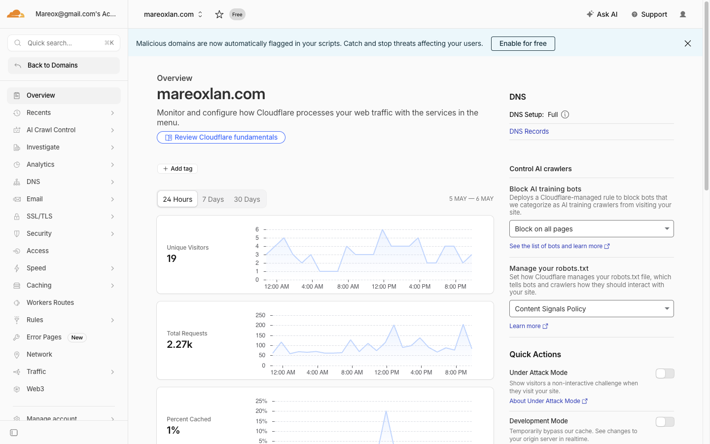
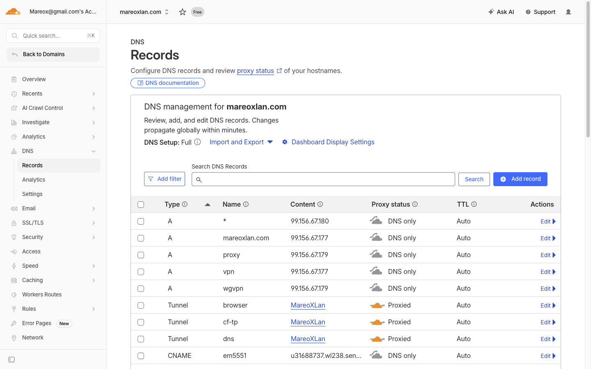
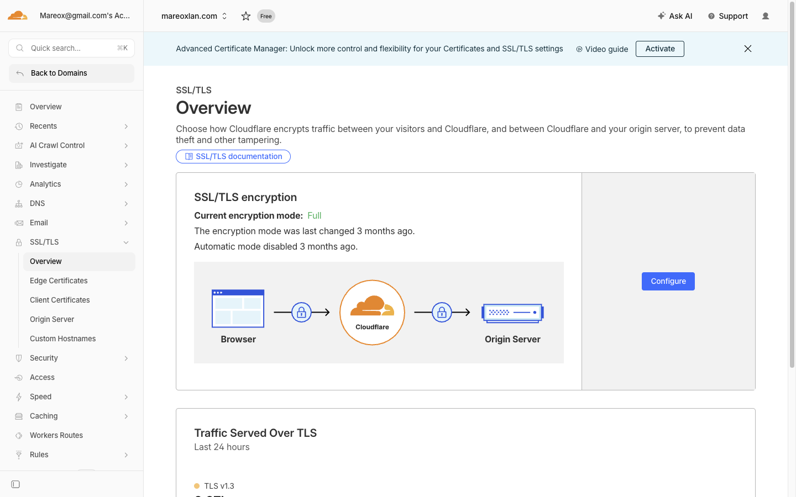
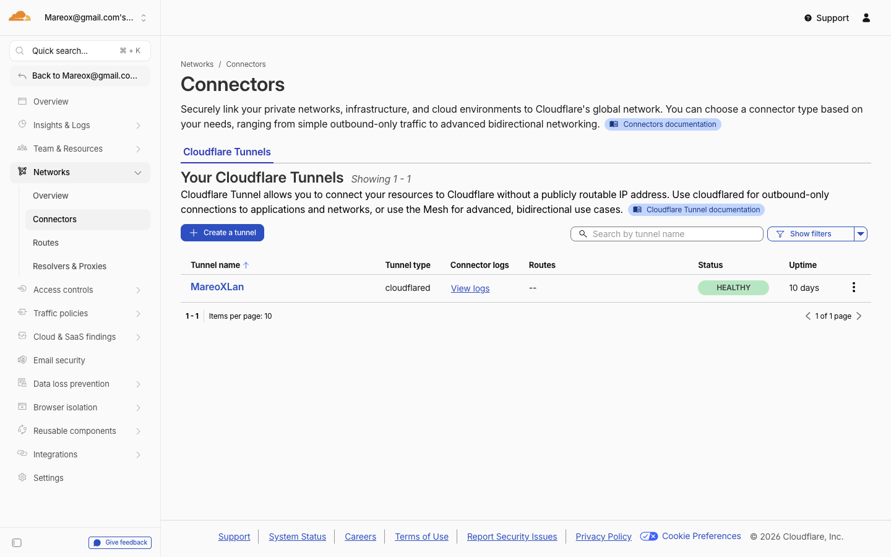
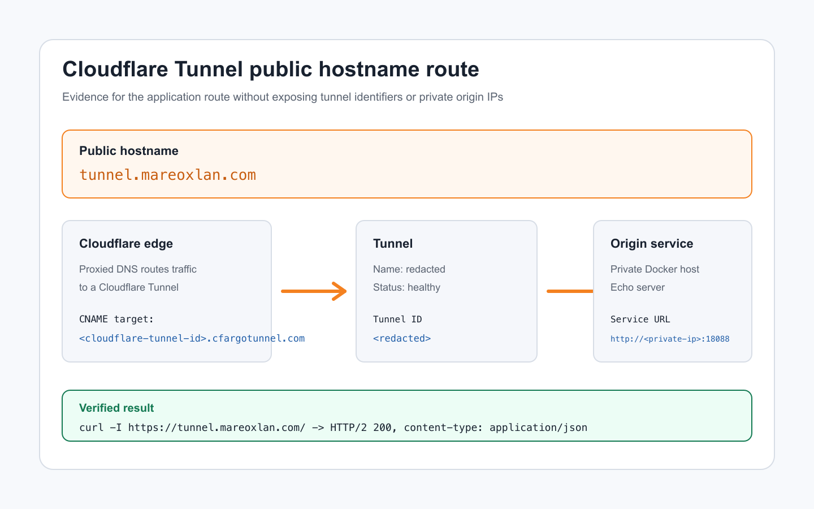
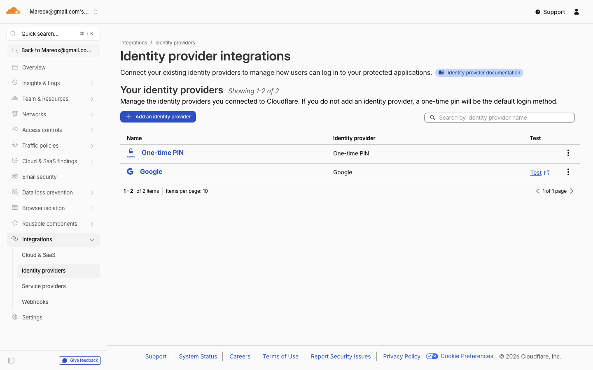

# Cloudflare Application Services Report

## 1. Working Application

The application is deployed on `mareoxlan.com` and uses Cloudflare DNS, Tunnel, Access, Workers, and R2.

| Endpoint | Access | Purpose |
| --- | --- | --- |
| <https://tunnel.mareoxlan.com/> | Public | Origin echo server that returns request headers as JSON. |
| <https://tunnel.mareoxlan.com/secure> | Cloudflare Access | Authenticated Worker page showing email, timestamp, and country code. |
| <https://tunnel.mareoxlan.com/secure/us> | Cloudflare Access | US flag served from private R2 through the Worker. |

Reviewer access:

- Login with an allowed identity through Cloudflare Access.
- `mareox@gmail.com` is allowed.
- Email addresses ending in `@cloudflare.com` are allowed.
- Users outside the Access policy are denied before reaching the Worker.

## 2. Implementation Steps and Evidence

### 2.1 Zone and DNS

The domain `mareoxlan.com` is active in Cloudflare. A proxied CNAME was created for:

```text
tunnel.mareoxlan.com -> <cloudflare-tunnel-id>.cfargotunnel.com
```

Evidence:





### 2.2 Origin Server

A small Flask origin server was deployed on the homelab Docker host Atlas. It returns the request method, path, query, remote address, timestamp, and all request headers as JSON.

The origin runs at:

```text
http://<private-origin-ip>:18088
```

Local health check:

```bash
curl http://127.0.0.1:18088/healthz
```

Result:

```text
ok
```

Public verification:

```bash
curl https://tunnel.mareoxlan.com/
```

Result: JSON response containing Cloudflare headers such as `Cf-Ray`, `Cf-Ipcountry`, `Cf-Connecting-Ip`, and `X-Forwarded-Proto`.

### 2.3 Full Strict TLS

The zone SSL mode was set to Full Strict. This validates the connection between Cloudflare and the origin when using a direct proxied origin pattern.

Evidence:



### 2.4 Cloudflare Tunnel

An existing Cloudflare Tunnel was reused. A public hostname was added:

```yaml
hostname: tunnel.mareoxlan.com
service: http://<private-origin-ip>:18088
```

This keeps the origin off the public internet. The origin only needs outbound connectivity to Cloudflare through `cloudflared`.

Evidence:





### 2.5 Identity Provider and Access Policy

Google was used as the identity provider. A Cloudflare Access self-hosted application protects:

```text
tunnel.mareoxlan.com/secure*
```

Allow policy:

- Include `mareox@gmail.com`
- Include emails ending in `@cloudflare.com`

Default behavior: block.

Evidence:



Unauthenticated test:

```bash
curl -I https://tunnel.mareoxlan.com/secure
```

Result: HTTP 302 redirect to Cloudflare Access login.

### 2.6 Worker and R2

The Worker `cf-application-secure` was deployed with these routes:

```text
tunnel.mareoxlan.com/secure
tunnel.mareoxlan.com/secure/*
```

The Worker reads the authenticated user from:

```text
Cf-Access-Authenticated-User-Email
```

The Worker reads the country from:

```text
request.cf.country
```

R2 bucket:

```text
country-flags
```

The bucket is private. The public read path is the Worker binding only.

Deployment commands:

```bash
cd worker
npx wrangler r2 bucket create country-flags
npx wrangler r2 object put country-flags/us.svg --file ./assets/us.svg --remote
npx wrangler deploy
```

Browser verification:

- `https://tunnel.mareoxlan.com/secure` showed the authenticated identity page.
- `https://tunnel.mareoxlan.com/secure/us` displayed the US flag.

R2 verification:

```bash
npx wrangler r2 object get country-flags/us.svg --remote --pipe
```

Result: SVG bytes returned from the private bucket.

## 3. Relevant Product Use Cases

| Product | Use case |
| --- | --- |
| Cloudflare DNS | Owns public routing for `mareoxlan.com` and points the app hostname to the Tunnel. |
| Cloudflare Tunnel | Publishes a private homelab service without inbound firewall rules or public origin exposure. |
| Cloudflare Access | Adds identity-aware protection in front of `/secure*` before traffic reaches the Worker or origin. |
| Workers | Runs application logic at the edge on the same hostname as the origin. |
| R2 | Stores static assets privately and exposes them only through a Worker binding. |
| Full Strict TLS | Validates the origin certificate chain when using Cloudflare as a reverse proxy. |

## 4. Knowledge Gaps Filled During the Process

The main gaps were around how the Cloudflare products interact when combined on the same hostname.

| Gap | How it was resolved |
| --- | --- |
| Whether the Worker must manually verify the Access JWT | Cloudflare Access documentation and live testing confirmed that Access enforces the policy before the Worker receives the request. The Worker can trust the injected email header when the route is correctly protected by Access. |
| How a private R2 bucket is read by a Worker | Wrangler configuration and testing confirmed that the R2 binding is the authorization path. No public bucket URL, access key, or signed URL is required in Worker code. |
| How to route only `/secure` to the Worker while leaving `/` on the origin | Worker route patterns were configured for `tunnel.mareoxlan.com/secure` and `tunnel.mareoxlan.com/secure/*`, while all other paths continue through the Tunnel origin. |
| How to avoid origin bypass | The Tunnel design removes inbound public access to the origin. The only external path is Cloudflare edge to Tunnel to origin. |

## 5. Target Customer Experience

A target customer would likely find the core experience strong once the mental model is clear.

The best part is the security outcome: an internal service becomes reachable from the internet without exposing the origin. Access adds identity enforcement before traffic reaches the application, and Workers add custom logic without changing the origin server.

The friction is in the setup boundaries. DNS, Tunnel ingress ordering, Access application paths, Worker route patterns, and R2 bindings all have to line up exactly. A technical operator can complete it quickly, but a customer without Cloudflare experience may need help understanding where each product owns part of the request path.

Overall, the stack is powerful for internal tools, homelabs, partner portals, lightweight admin apps, and customer support tools where identity-aware access and private origin exposure matter more than traditional network perimeter access.
